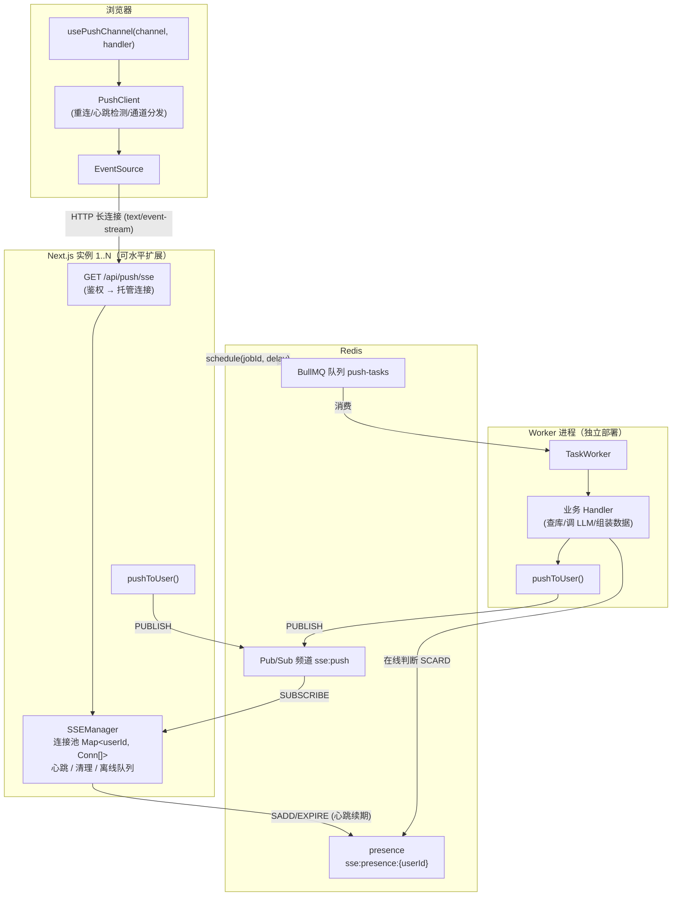
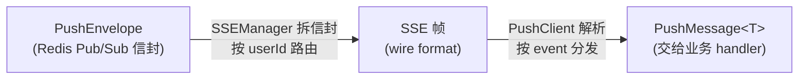
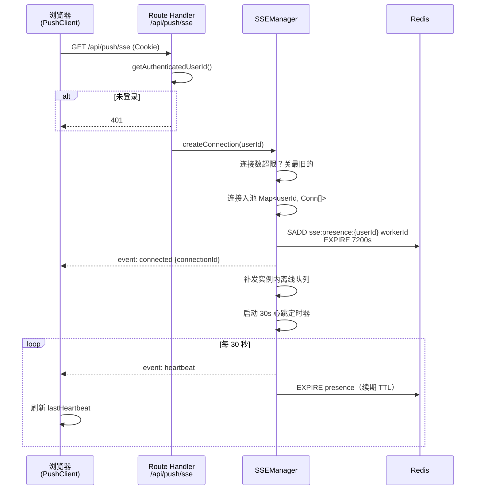
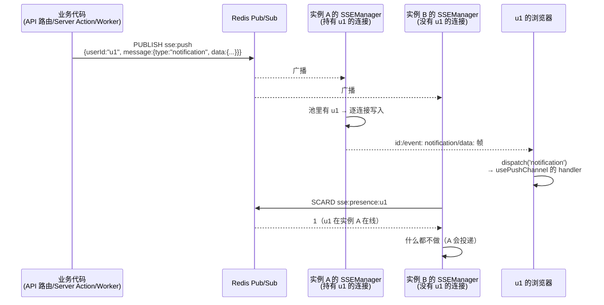
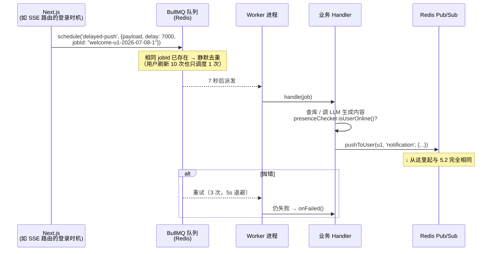
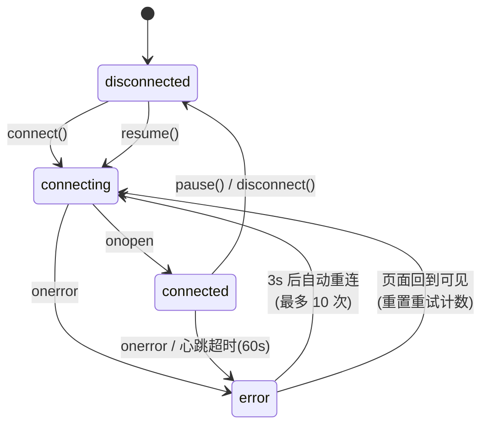
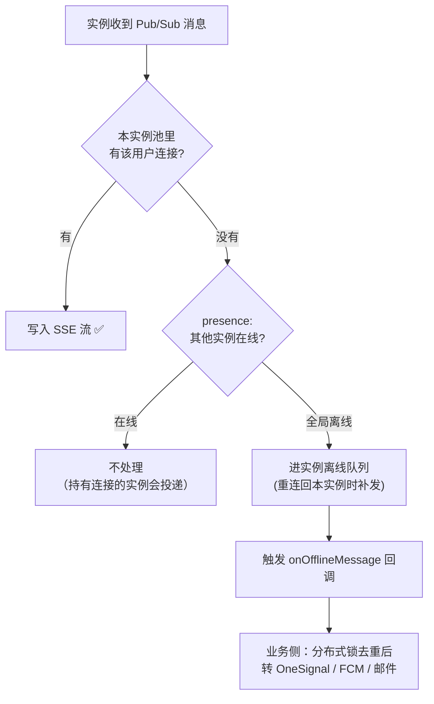

# 从零设计一套 Next.js 服务端主动推送系统：SSE + Redis Pub/Sub + BullMQ

> 本文是 [nextjs-sse-push](../skills/nextjs-sse-push) 这个 skill 背后系统的完整设计复盘：需求怎么拆、技术怎么选、架构怎么定、接口和 DTO 长什么样、每条用户流程如何流转，以及生产环境踩过的坑。代码模板见 skill 仓库，本文讲「为什么是这样」。

---

## 一、问题：服务端想主动找前端说话

这套系统最初为一个 AI 陪伴产品而建：AI 角色要**主动**给用户发消息——用户注册 7 秒后收到第一条欢迎语、老用户每天回访时收到问候、每天 8:30 定时推送。后来发现这就是一个通用问题：**站内通知、未读角标、长任务进度、多端同步信号**，本质都是"服务端事件发生了，要立刻告诉正在线上的那个用户"。

把需求拆开，其实是五件事：

| 需求 | 含义 | 技术含义 |
| --- | --- | --- |
| 实时推送 | 事件发生，在线用户秒级收到 | 需要一条服务端→客户端的长连接 |
| 延迟推送 | "注册 7 秒后发欢迎语" | 需要可靠的延迟任务队列 |
| 定时推送 | "每天 8:30 推日报" | 需要 cron 调度 |
| 离线兜底 | 用户不在线时转走 Push Notification/邮件 | 需要跨进程判断"用户在不在线" |
| 水平扩展 | Next.js 部署多个实例，用户连在哪个实例不确定 | 推送方不能直接操作连接 |

第 5 条是整个架构的分水岭——它决定了**推送和连接必须解耦**。

## 二、技术选型

### SSE 而不是 WebSocket

场景是纯单向（服务端→客户端），客户端上行走普通 HTTP API 就够了。这时 SSE 全面占优：

| | SSE (EventSource) | WebSocket |
| --- | --- | --- |
| 方向 | 单向（够用） | 双向（多余） |
| 协议 | 纯 HTTP，代理/CDN/防火墙友好 | 需要 Upgrade，部分中间件不友好 |
| 自动重连 | **协议内置**（`retry:` 字段） | 自己写 |
| 断点续传 | 内置 `Last-Event-ID` | 自己写 |
| Next.js 支持 | Route Handler 返回 `ReadableStream` 即可 | 需要自定义 server，和 Next.js 部署模型冲突 |
| 限制 | 不能自定义 Header（鉴权走 Cookie）；HTTP/1.1 同域 6 连接上限 | — |

最后一行的两个限制都可接受：鉴权用 Cookie（同源自动携带），HTTP/2 下没有 6 连接问题。

### 任务队列：BullMQ

延迟和定时任务需要"Next.js 进程重启也不能丢"，所以必须持久化到进程外。Redis 反正要用（见下），BullMQ 是 Redis 生态里最成熟的选择：延迟任务、cron（Repeatable Jobs）、重试退避、幂等 jobId 全都有。

### 消息总线：Redis Pub/Sub

多实例问题的标准解法：连接池是实例本地的内存状态，推送方把消息**广播**出去，谁持有连接谁投递。Redis Pub/Sub 延迟低、模型简单，且 Redis 已经因为 BullMQ 在栈里了——不引入新组件。

> 取舍：Pub/Sub 是 fire-and-forget，没有持久化。这里它只承担"在线投递"的路径，可靠性语义由上层保证（离线兜底 + 需要收件箱语义时业务落库）。

## 三、系统设计

### 3.1 总体架构



三个角色、三条纪律：

1. **Next.js 实例**：持有 SSE 连接，但**任何人都不直接调用它推送**——它只做两件事：托管连接、订阅 Redis 频道并投递给自己池子里的用户。
2. **Worker 进程**：执行延迟/定时任务。它摸不到任何连接池，推送一律经 Redis。
3. **Redis**：唯一的共享状态。Pub/Sub 管"消息路由"，BullMQ 管"时间"，presence 管"谁在线"。

### 3.2 核心抽象：通道（Channel）

系统对业务数据**零感知**。唯一的约定是每条消息挂在一个字符串通道下：

- 后端：`pushToUser(userId, 'badge-update', { unreadCount: 3 })`
- 前端：`usePushChannel<{ unreadCount: number }>('badge-update', handler)`

通道名就是 SSE 协议里的 `event:` 字段。新增一种消息类型 = 前后端约定一个新通道名 + 业务自己定义 `data` 的 TypeScript 类型，**推送系统本身零改动**。这是从第一版（中心化枚举 + 一个大 switch 分发所有消息类型）演进来的：枚举版每加一种消息都要改中心枢纽，订阅制则是"谁关心谁订阅"。

## 四、DTO 与接口设计

### 4.1 三层数据格式

消息在链路上有三种形态，逐层剥壳：



**① Redis 信封 `PushEnvelope`**——多带一个 `userId` 用于路由：

```ts
interface PushEnvelope {
  userId: string;          // 路由目标，投递前剥掉
  message: SSEMessage;
}

interface SSEMessage<T = unknown> {
  id: string;              // 消息 ID（randomUUID），前端可据此去重
  type: string;            // 通道名，即 SSE 的 event 字段
  data: T;                 // 业务数据，系统不解释
  retry?: number;          // 可选：指示客户端重连间隔
  timestamp: number;
}
```

**② SSE 帧（wire format）**——标准 `text/event-stream`，一条消息一个帧：

```
id: 550e8400-e29b-41d4-a716-446655440000
event: badge-update
data: {"unreadCount":3}

```

**③ 前端 `PushMessage<T>`**——业务 handler 收到的最终形态，`T` 由订阅方声明：

```ts
interface PushMessage<T = unknown> {
  id: string;      // 取自 SSE 帧的 id（event.lastEventId）
  type: string;    // 通道名
  data: T;         // JSON.parse 后的业务数据
  timestamp: number;
}
```

两个**内置通道**由系统自己消费，不进业务 handler：`connected`（连接确认，携带 connectionId）和 `heartbeat`（保活 + 客户端死连接检测）。

### 4.2 HTTP 接口

整个系统对外只有**一个** HTTP 端点：

```
GET /api/push/sse
├─ 鉴权：Cookie（EventSource 不支持自定义 Header）
├─ 401：未登录
└─ 200：Content-Type: text/event-stream
         Cache-Control: no-cache, no-transform
         X-Accel-Buffering: no        ← 防 Nginx 缓冲
```

之所以能只有一个端点：推送的触发方在服务端内部（`pushToUser` 是进程内函数调用 + Redis publish），不需要暴露 HTTP 面。如果要给外部系统开推送口，再包一个带鉴权的 POST 即可。

### 4.3 服务端编程接口

```ts
// —— 即时推送（任何进程可调）——
pushToUser<T>(userId: string, channel: string, data: T, options?: { id?: string }): Promise<void>
pushToUsers<T>(userIds: string[], channel: string, data: T): Promise<void>

// —— 延迟/定时（Next.js 侧入队）——
queueClient.schedule<T>(taskName: string, {
  payload: T,
  delay?: number,                      // 延迟毫秒数
  jobId?: string,                      // 确定性 ID = 幂等键
  removeOnComplete?: boolean | { age: number },
}): Promise<Job>
queueClient.removeJob(jobId): Promise<void>   // 取消未执行的任务

// —— 任务处理（Worker 侧实现）——
interface ITaskHandler<T> {
  name: string;                        // 必须与 schedule 的 taskName 一致
  handle(job: Job<T>): Promise<void>;  // 业务逻辑，最后通常调 pushToUser
  onFailed?(job, error): void;         // 重试耗尽后的钩子
  onCompleted?(job, result): void;
}

// —— 在线判断（Worker 决定推送策略用）——
presenceChecker.isUserOnline(userId): Promise<boolean>
```

### 4.4 前端编程接口

```ts
// 应用根部调用一次，建立并维持连接，返回实时状态
usePushConnection(): 'disconnected' | 'connecting' | 'connected' | 'error'

// 任意组件订阅通道；handler 无需 memo（内部 ref 保活），卸载自动退订
usePushChannel<T>(channel: string, handler: (data: T, message: PushMessage<T>) => void): void

// 底层原语（非 React 环境 / WebView 壳层用）
getPushClient().connect() / .disconnect() / .pause() / .resume() / .subscribe(channel, fn)
```

## 五、用户流程

### 5.1 建立连接



细节：

- **每用户连接上限**（默认 5）：用户开多个标签页时每页一条连接，超限踢最旧的，防资源泄漏。
- **presence TTL 靠心跳续期**：实例崩溃来不及清理时，key 自己过期——不会出现永远的"假在线"。
- **连上先补发离线队列**：实例内存里为断线用户暂存的消息（上限 50 条）此刻倾倒下去，覆盖"刷新页面丢了两秒消息"的场景。

### 5.2 即时推送全链路



发布方完全不知道（也不需要知道）用户连在哪个实例、开了几个标签页。每个实例收到广播后独立决策：**有连接就写，没连接就查 presence——别的实例在线就闭嘴，全局离线才走兜底。**

### 5.3 延迟 / 定时推送



两个关键设计：

- **幂等靠确定性 jobId**。触发点常常不可控地重复（用户反复刷新页面、多标签页同时建连），把"业务语义"编码进 jobId（`welcome-${userId}-${date}-${seq}`），BullMQ 保证同 ID 任务完成前不重复入队。配合 `removeOnComplete: { age: 172800 }` 保留两天防止 ID 立即可复用。
- **cron 走 Repeatable Jobs，注册时先删后加**。改了 cron 表达式后，旧 pattern 的注册若不清理会变成僵尸任务继续触发。Worker 启动时按 handler 名清掉所有旧注册再添加当前配置。典型用法是**扇出**：一个 dispatcher 定时任务（每小时 :25）扫描目标用户，再为每人 schedule 一个具体推送任务。

### 5.4 前端连接状态机



三个容易漏的死角，这个状态机都覆盖了：

1. **EventSource 的假活连接**：某些网络切换（Wi-Fi→蜂窝、休眠唤醒）后连接已死但不触发 `error`。解法是服务端 30s 心跳 + 客户端 60s 没收到心跳就强制拆掉重连。
2. **重试耗尽后的复活**：10 次重连失败后停在 `error`（比如用户断网半小时），但 `visibilitychange` 回到可见时**重置计数再试**——覆盖"锁屏回来"场景。
3. **WebView 壳层**：原生 App 进后台时系统会掐长连接，暴露 `pause()/resume()` 原语让壳层桥接生命周期，`pause` 保留所有订阅关系，`resume` 原地满血复活。

### 5.5 离线兜底



`onOfflineMessage` 是刻意留白的扩展点——离线推送渠道是业务选择，系统只负责在"确认全局离线"时机通知你。注意**多实例下每个无连接实例都会走到这个回调**，全局只发一次的语义要业务用分布式锁（`SET NX` + `message.id`，60s 过期）自己收口——原项目就是这么接 OneSignal 的。

## 六、实现细节：那些必须写进代码注释的坑

**1. EventSource 自定义事件会静默丢消息。** 服务端发 `event: badge-update`，前端没有 `addEventListener('badge-update')`，这条消息**无声无息地消失**——不进 `onmessage`，不报错。所以 `PushClient` 在建连时为所有已订阅通道绑定监听、连接存活期间新订阅的通道即时补绑，且重连后重新绑一遍（新 EventSource 实例上什么都没有）。

**2. Redis 连接必须分三种，不能混用。**

| 工厂 | 配置要点 | 用途 |
| --- | --- | --- |
| `getSharedRedis()` | 普通配置，全进程单例 | PUBLISH、presence 命令 |
| `createSubscriberRedis()` | 独占连接 | ioredis 进入 subscribe 模式后**不能再发普通命令** |
| `createBullMQRedis()` | `maxRetriesPerRequest: null` | BullMQ 的硬性要求，缺了直接抛错 |

**3. Next.js dev 热重载会重复实例化模块级单例。** 每次热更新都可能重新执行模块，朴素的 `export const manager = new SSEManager()` 会积累出 N 份 Redis 订阅（每条消息投递 N 次）。所有单例都要走 `globalThis` 缓存：

```ts
const g = globalThis as unknown as { __sseManager?: SSEManager };
export const sseManager = g.__sseManager ?? new SSEManager();
if (process.env.NODE_ENV !== 'production') g.__sseManager = sseManager;
```

**4. SSE 路由必须声明 Node.js runtime 且禁止静态化**（`export const dynamic = 'force-dynamic'; export const runtime = 'nodejs'`），响应头带 `X-Accel-Buffering: no` 防 Nginx 缓冲——否则消息会攒在代理里成批到达，实时性归零。

**5. Worker 优雅关闭要关到 Redis 连接为止。** `worker.close()` 只等任务跑完，不 `redis.quit()` 进程根本退不出去（event loop 被连接挂住）。再加 10s 超时强杀兜底，防止部署卡死。

**6. React StrictMode 双调 effect。** `usePushConnection` 的 cleanup 里**不**做 disconnect（StrictMode 会造成一次无谓的断连重连），依赖 `connect()` 幂等 + `beforeunload` 兜底；登出等场景显式调 `disconnect()`。

## 七、从业务系统到可复用模板

这套系统第一版长在业务里：消息类型是硬编码枚举、前端是 zustand store + 一个中心化 orchestrator（大 switch 按类型分发到各业务 store）、离线兜底直接内嵌 OneSignal 调用。抽象成 skill 时的三条泛化原则：

1. **把"类型系统"降级为"命名约定"**：通道名自由字符串，data 泛型化。代价是失去了中心化的消息类型 exhaustiveness 检查，换来的是推送系统与业务的完全解耦——权衡点在于消息类型的所有权本来就该归业务。
2. **把"依赖"降级为"原语"**：zustand → 纯 TS 类 + `useSyncExternalStore`；Android 生命周期监听 → `pause()/resume()`。模板不该替目标项目做技术栈选择。
3. **把"实现"降级为"扩展点"**：OneSignal → `onOfflineMessage` 回调；日志/监控 → console（接入点都在，栈自己挑）。

最终目标项目的接入成本收敛到三件事：**实现一个鉴权函数**（route 里的 `getAuthenticatedUserId`）、**配一个 `REDIS_URL`**、**写一个展示通知的组件**。其余全是复制模板。

## 八、边界与演进方向

诚实地说清楚这套系统**不是**什么：

- **不是可靠投递**。Pub/Sub 是 fire-and-forget，实例内离线队列只覆盖"短暂断线回到同一实例"。需要收件箱语义（离线消息必达、多端已读同步）时，正确做法是消息落库，前端连上先拉历史、再听增量——SSE 层只当"有新消息"的信号用。
- **单频道广播有上限**。所有实例反序列化所有消息，万级并发内没问题；再往上可以按 userId 哈希分片频道（`sse:push:{shard}`），实例只订阅自己负责的分片。
- **Vercel Serverless 不是理想宿主**。函数时长上限会周期性掐断 SSE（客户端自动重连，体验是偶发闪断），长连接体验要求高就用 Docker / Fly.io / Railway 跑常驻进程。

> 续篇：[系统设计自评——这套系统做得怎么样？有没有更好的方案？](./nextjs-sse-push-review.md)，换评审视角把短板和替代方案说透。

---

*系统的完整模板代码（后端 SSEManager / BullMQ / presence，前端 PushClient / Hooks）已沉淀为 Agent Skill：`npx skills add hifizz/skills --skill nextjs-sse-push`。本文同步于 [zilin.im](https://zilin.im)，源码见 [hifizz/skills](https://github.com/hifizz/skills)。*
