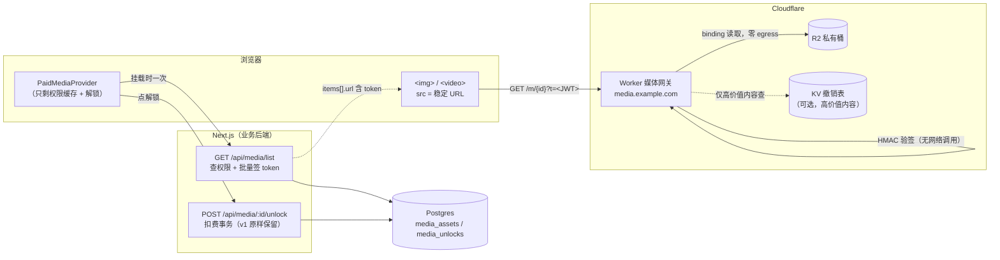
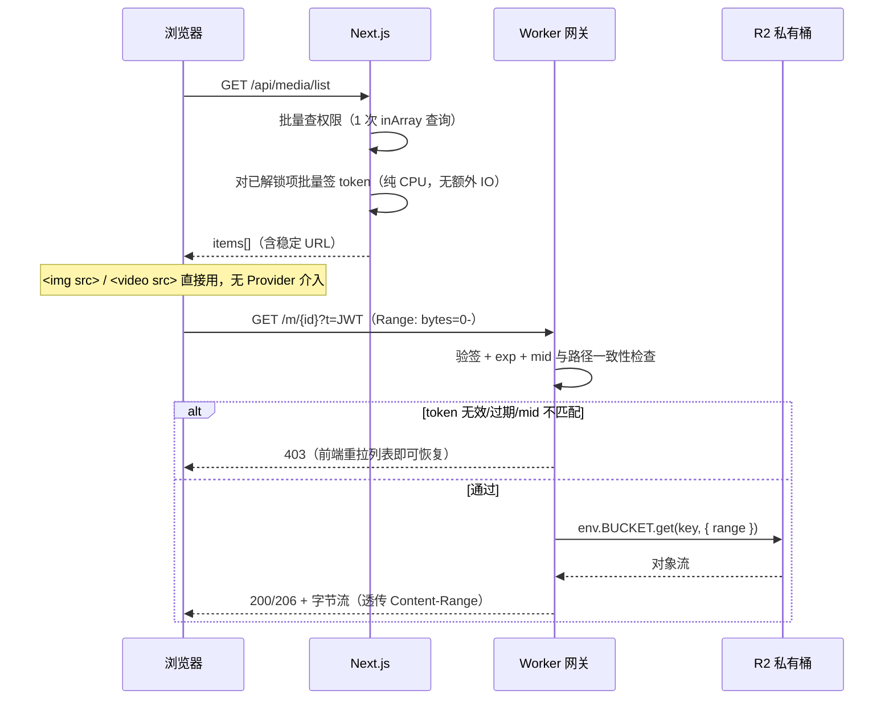
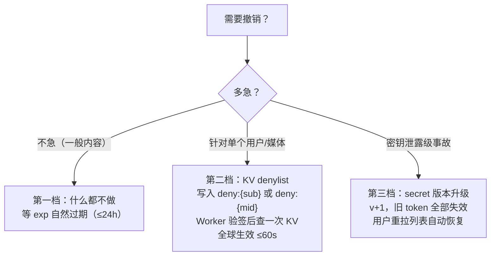
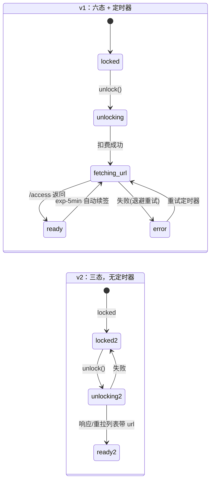

# 设计方案 v2：Worker 媒体网关（替代预签名 URL）

> 本文是 `architecture.md`（v1，预签名 URL 方案）的演进设计。v1 的两个结构性弱点——
> **URL 过期把续签状态机推给客户端**、**画廊页签发 URL 的 N+1**——在这里被消除。
> 解锁事务层、数据模型、Provider 的权限/解锁部分**原样保留**，只替换媒体访问层。

## 0. 设计目标

| 目标 | v1（预签名 URL） | v2（Worker 网关） |
| --- | --- | --- |
| URL 稳定，前端无续签逻辑 | ✗ 30min 过期 + 续签状态机 | ✓ URL 在 token 有效期内稳定 |
| 消除画廊页 N+1 | ✗ 每个媒体一次 `/access` | ✓ 列表响应批量带 URL |
| 秒级撤销 | ✗ 只能等 TTL | ✓ 三档撤销策略 |
| 带宽零成本 | ✓ 浏览器直连 R2 | ✓ Worker 读同区 R2 binding 免 egress |
| 隐藏 R2 域名 | ✗ 暴露 `*.r2.cloudflarestorage.com` | ✓ 自有域名 `media.example.com` |
| 视频 Range/拖进度条 | ✓ R2 原生 | ✓ binding 支持 range 读取 |
| 额外部署单元 | 无 | **一个 Worker + 一个共享密钥**（本方案的全部代价） |

## 1. 总体架构



职责划分一句话：**Next.js 负责「谁有权看什么」（签 token），Worker 负责「按 token 发字节」（验签 + 流式回传）**。Worker 不连数据库、不理解业务，是纯粹的验签流媒体网关——这保证它的延迟稳定在个位数毫秒，且永远不需要跟业务一起发版。

## 2. Token 设计：「列表即授权」

v1 的 N+1 根源是「授权」和「取列表」是两个动作。v2 把它们合并：**list 接口在返回列表时，就对每个已解锁项签好 token 并拼进 URL**。

```jsonc
// GET /api/media/list 响应（对比 v1，多了 url 字段）
{
  "items": [
    {
      "id": "81410678-…",
      "mediaType": "IMAGE",
      "creditsCost": 10,
      "isUnlocked": true,
      "blurhash": "L6Pj0^…",
      // 已解锁 → 直接给可用的稳定 URL；未解锁 → 无此字段
      "url": "https://media.example.com/m/81410678-…?t=eyJhbGciOi…"
    }
  ]
}
```

token 是一个 HS256 JWT（Next.js 与 Worker 共享一个 secret，Worker 侧存 secret binding）：

```jsonc
{
  "mid": "81410678-…",   // 绑定到单个媒体，token 泄露只影响这一个文件
  "sub": "user-uuid",    // 签给谁（审计 + 可选的按用户撤销）
  "exp": 1767225600,     // 默认 24h；高价值内容缩短
  "v": 1                 // secret 版本号，全局轮换用（撤销第三档）
}
```

设计取舍：

- **绑定 `mid` 而不是签「全量通行证」**：一个 token 只能取一个对象，被分享的爆炸半径最小。
- **`exp` 默认 24h**：比 v1 的 30 分钟长得多——因为撤销不再依赖过期（见 §4），TTL 只是兜底。24h 意味着用户一次会话内 URL 永远稳定，浏览器缓存也能正常工作；下次进页面重新拉列表自然拿到新 token。**前端从此没有任何续签逻辑。**
- **不做 IP 绑定**：移动网络切换基站就换 IP，绑定 IP 的实际效果是折磨付费用户而不是阻止分享者。
- HMAC 验签是纯 CPU 运算，Worker 里 <1ms，不产生任何网络调用。

## 3. 访问链路



对比 v1：浏览器到字节的路径上，**Postgres 完全不在热路径里**——权限检查只发生在签 token 的那一刻（list / unlock），之后每次媒体请求都是纯验签。v1 的策略 B（代理）每个字节请求都要查一次库，v2 用「签发时查库 + 访问时验签」把这次查询摊销掉了。

## 4. 撤销策略：三档

v1 撤销只能等 TTL。v2 按内容价值分三档，成本递增：



第二档是可选组件：只对标记为高价值的媒体启用 KV 查询（`media_assets` 加一个 `revocable` 布尔列，签进 token），普通内容维持零 KV 读取。这样 99% 的请求保持纯 CPU 验签，1% 的高价值请求多付一次 KV 读（~1ms，且有边缘缓存）。

## 5. Worker 实现骨架

完整实现约 80 行，核心逻辑：

```ts
// worker/src/index.ts
export default {
  async fetch(request: Request, env: Env): Promise<Response> {
    const url = new URL(request.url)
    const match = url.pathname.match(/^\/m\/([0-9a-f-]{36})$/)
    if (!match) return new Response('Not found', { status: 404 })
    const mediaId = match[1]

    // 1. 验签（jose 或 Web Crypto HMAC，纯 CPU）
    const payload = await verifyToken(url.searchParams.get('t'), env.MEDIA_TOKEN_SECRET)
    if (!payload || payload.mid !== mediaId || payload.exp * 1000 < Date.now()) {
      return new Response('Forbidden', { status: 403 })
    }

    // 2. 可选：高价值内容查 KV denylist（第二档撤销）
    if (payload.rv && (await env.DENYLIST.get(`deny:${payload.sub}`))) {
      return new Response('Forbidden', { status: 403 })
    }

    // 3. R2 binding 读取，透传 Range
    const range = parseRange(request.headers.get('Range'))
    const object = await env.MEDIA_BUCKET.get(objectKeyOf(payload), { range })
    if (!object) return new Response('Not found', { status: 404 })

    const headers = new Headers()
    object.writeHttpMetadata(headers)          // Content-Type 等来自上传时的元数据
    headers.set('Accept-Ranges', 'bytes')
    headers.set('Cache-Control', 'private, max-age=3600')
    if (range) headers.set('Content-Range', formatContentRange(range, object.size))

    return new Response(object.body, { status: range ? 206 : 200, headers })
  },
}
```

```toml
# worker/wrangler.toml
name = "paid-media-gateway"
main = "src/index.ts"
routes = [{ pattern = "media.example.com/*", zone_name = "example.com" }]

[[r2_buckets]]
binding = "MEDIA_BUCKET"
bucket_name = "paid-media"

# secret 用 wrangler secret put MEDIA_TOKEN_SECRET 注入
```

实现注意点：

- **对象 key 从 token 推导**（`images/{mid}.ext` 的 ext 也签进 token 或统一化），Worker 不查任何表。
- `` / `<video>` 的简单 GET 不触发 CORS preflight，token 在 query 里也不需要 `crossorigin` 属性——跨子域名开箱即用。
- 日志：`console.log(payload.sub, mediaId)` 进 Workers Logs，天然是审计日志（谁在什么时候拉了什么），v1 的预签名方案做不到这一点（R2 直连日志里没有业务身份）。

## 6. 前端简化：Provider 状态机对比



v2 的 Provider 删掉的东西：`accessMap`、续签定时器、退避重试、`REFRESH_BUFFER`、`fetchAccess` 全部——约 40% 的代码。保留的东西：权限批量缓存、`unlock()`、错误态。`usePaidMediaItem` 的对外契约不变（`{ status, url, unlock }`），**业务展示组件一行不用改**——这正是 headless Provider 当初承诺的价值。

## 7. 从 v1 迁移路径

改动面被 v1 的分层锁得很小：

| 层 | 动作 |
| --- | --- |
| 数据模型（schema.ts） | **不变**（可选加 `revocable` 列） |
| 解锁事务（unlock-service.ts） | **不变** |
| 权限服务（permission-service.ts） | **不变** |
| `config.ts` adapter | **不变** |
| list 路由 | +10 行：对已解锁项签 token 拼 URL |
| `access` / `content` 路由 | 删除（保留一个发版周期做灰度回退） |
| Provider | 删 URL 生命周期部分 |
| 新增 | `worker/` 目录（~80 行）+ `MEDIA_TOKEN_SECRET` 两处配置 |

灰度策略：list 同时返回 v2 URL 和保留 v1 `/access`，前端按 feature flag 切换，观察一周 Worker 错误率后下线 v1 路由。

## 8. 成本

- Worker 请求：$0.30/百万（前 1000 万/月免费）；R2 Class B 读：$0.36/百万——**与 v1 相同**（预签名 GET 同样计 Class B）。
- egress：$0（binding 读取不计流量）——与 v1 相同。
- **净增成本 = Worker 调用费**，对绝大多数项目就是零（免费额度内）。

## 9. 什么时候仍然选 v1

- 项目**不在 Cloudflare 生态**（存储在 S3/MinIO），Worker binding 的零 egress 优势不存在，此时预签名 URL 仍是标准解。
- **坚持单部署单元**：不想多管一个 Worker 和一个密钥的团队，v1 的运维面确实更小。
- 原型/验证期：v1 一个下午能跑通，v2 值得在确认付费模型成立之后再上。

两套方案共享解锁事务层和数据模型，v1 → v2 是演进不是重写——这也是当初把存储访问和权限判定分成两层的原因。
